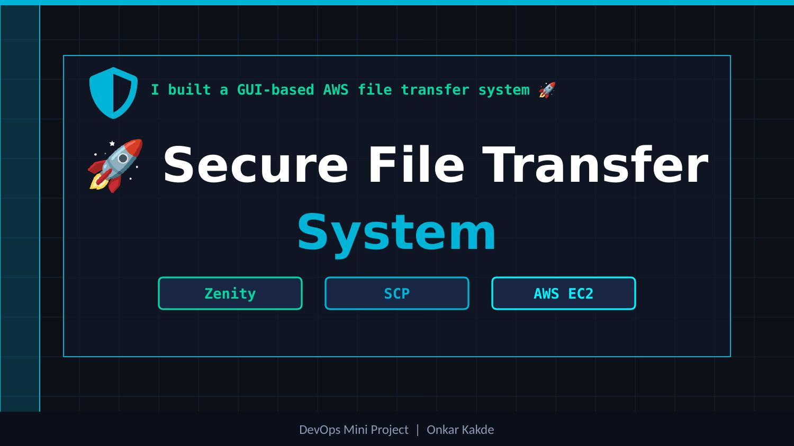
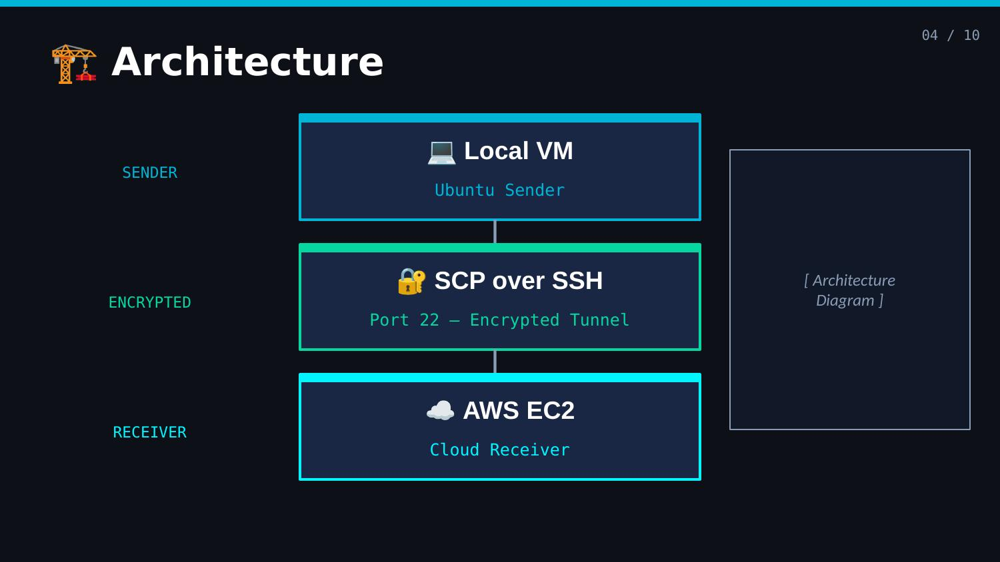
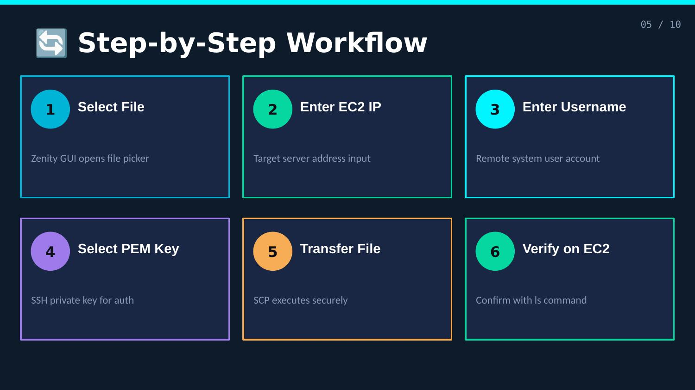
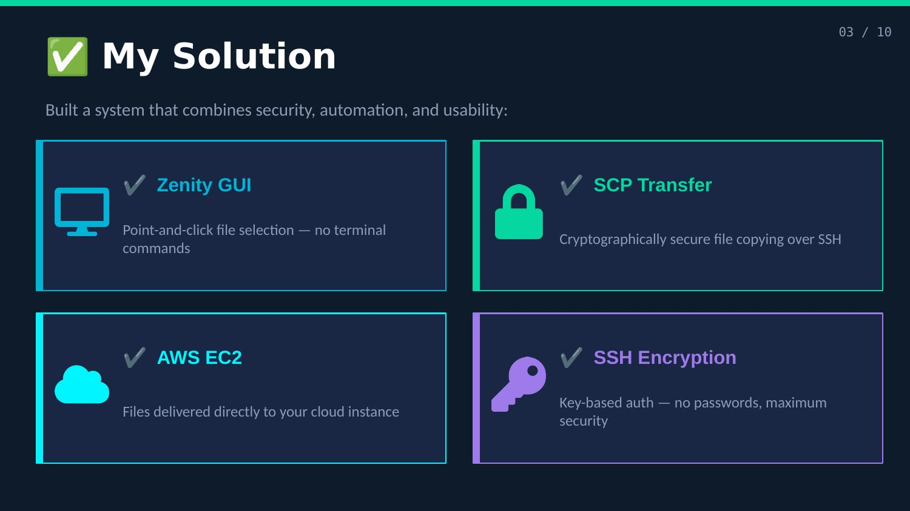
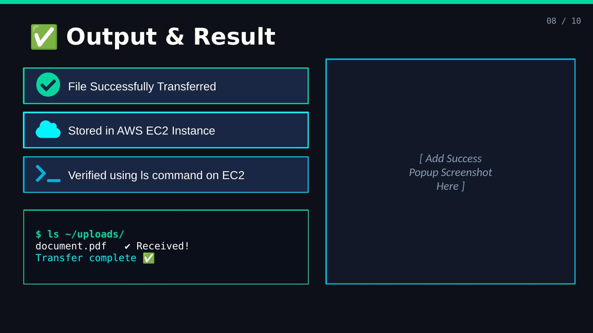

🚀 FINAL PROFESSIONAL README.md
# 🚀 Secure File Transfer System (Zenity + SCP + AWS EC2)



---

## 📌 Overview

A GUI-based secure file transfer system that allows users to send files from a **Local Linux VM** to an **AWS EC2 instance** using **SCP over SSH**.

This project simplifies complex terminal commands by providing a **user-friendly Zenity interface**.

---

## ✨ Features

- 🔐 Secure file transfer using SCP (SSH encryption)
- 🖥️ GUI-based interface using Zenity
- 🔑 Key-based authentication (PEM file)
- 📊 Real-time progress bar
- ⚠️ Error handling and validation

---

## 🏗️ Architecture




Local VM ──▶ SCP (SSH) ──▶ AWS EC2


---

## 🔄 Workflow



1️⃣ Select file via GUI  
2️⃣ Enter EC2 Public IP  
3️⃣ Enter username  
4️⃣ Select PEM key  
5️⃣ Transfer file securely  
6️⃣ Verify on EC2  

---

## ⚙️ Tech Stack

| Technology | Usage |
|----------|------|
| Linux (Ubuntu) | Environment |
| AWS EC2 | Cloud server |
| Bash | Scripting |
| SCP | File transfer |
| SSH | Secure communication |
| Zenity | GUI |

---

## 📸 Screenshots

### 🖥️ GUI Interface


### 🔐 Secure Transfer


### ☁️ AWS EC2 Setup


### ✅ Output


---

You’re very close — your README formatting is just **broken because code blocks aren’t closed properly** ❌
I’ll fix it cleanly so it renders perfectly on GitHub ✅

---

# ✅ **Corrected README Section (Copy This)**

## 🛠️ Installation
````md


```bash
sudo apt update
sudo apt install zenity openssh-client -y
````

---

## ▶️ Usage

```bash
chmod +x zenity_scp_final.sh
./zenity_scp_final.sh
```

---

## 🔐 SCP Command

```bash
scp -i key.pem file.txt ubuntu@<EC2-IP>:/home/ubuntu/
```

---

## 📄 Documentation

📥 [Download Full Project Report](docs/Major_Project_Report.pdf)

---

## 🧠 Learning Outcomes

* ☁️ Cloud integration using AWS EC2
* 🔐 Secure file transfer using SCP
* 🧩 Shell scripting automation
* 🖥️ GUI development using Zenity
* 🚀 Real-world DevOps workflow

---

## 👨‍💻 Author

**Onkar Kakde**
💼 DevOps & Cloud Enthusiast

---

## ⭐ Support

If you like this project, give it a ⭐ on GitHub!

````
